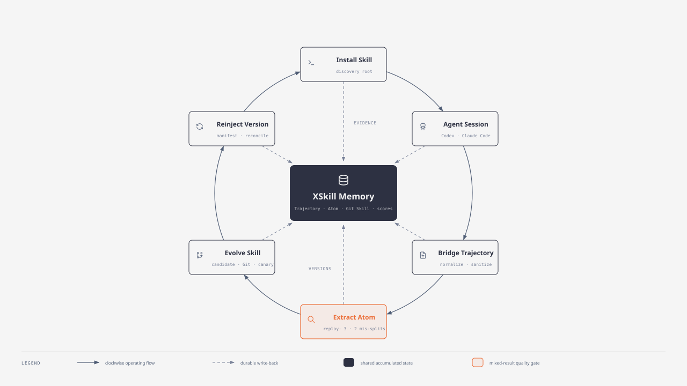
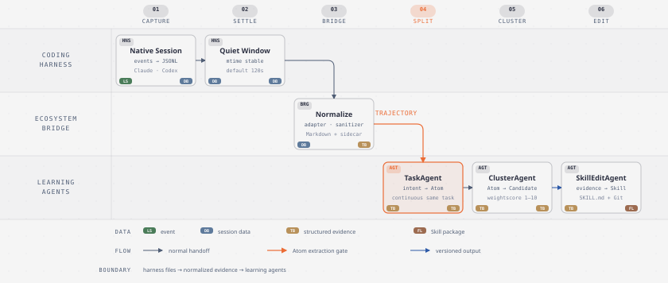
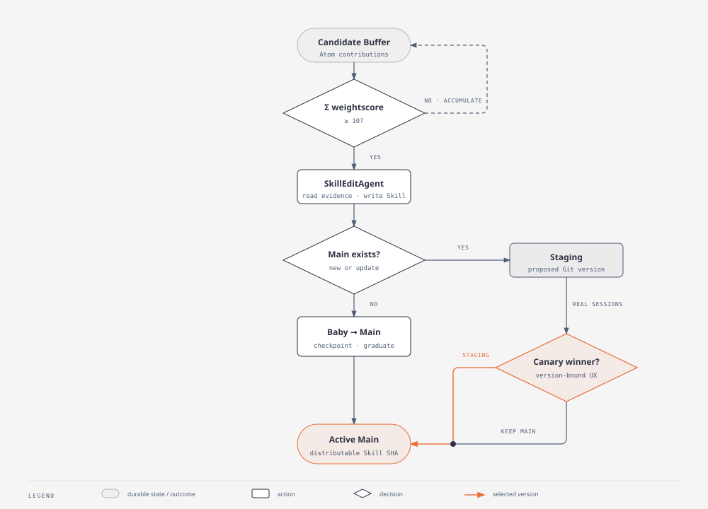

# XSkill：从 Coding Agent 轨迹到可回注 Skill 的自进化闭环

> Repo Reading · 2026-08-28 · 面向算法与 Agent 工程同事<br>
> 源码基线：[`SkillNerds/xskill@bc9bf94`](https://github.com/SkillNerds/xskill/tree/bc9bf941662467ac711523e450968f2677cd230e)<br>
> 阅读目标：理解 **如何注入、何时采集、怎样提取、如何回注、实验验证到了哪里**。

这份 README 是本次 repo reading 的唯一主报告。静态逐文件 walkthrough、完整源码调查、实验长报告、脱敏证据和 SWE-bench 候选都移到了 [`references/`](./references/)，用于追溯而不是承担主叙事。

## 培训结束后应该能回答的五个问题

1. XSkill 是否修改了 Codex / Claude Code 的进程或 system prompt？
2. Coding agent 会话结束后，为什么不是立刻进入学习流水线？
3. Trajectory、Atom、Candidate、Skill 分别是什么，为什么不能混用？
4. Weightscore 与 UX Score 各自控制哪一个决策？
5. 本次真实实验到底证明了哪些阶段，又在哪一步失败？

## 第一层：先看整体闭环



<sub>图源：[HTML](./diagrams/xskill-self-evolution-loop.html)。实线是一次工作循环，虚线是每一步向中央持久状态回写证据；橙色 Atom 节点是本次实验没有通过的关口。</sub>

一句话概括：**XSkill 用文件协议接在 coding harness 两端——把 Skill 目录装进去，再把原生会话文件读出来；中间把一次会话逐级提炼为可版本化的 Skill，最后重新安装到下一轮 agent session。**

它不是：

- Codex / Claude Code 的进程 hook；
- 在每次请求前动态改写 system prompt 的代理；
- 把整段聊天直接摘要后覆盖 `SKILL.md`；
- 只靠一次离线 LLM 打分决定 Skill 上线。

## 第二层：六个高层步骤

| 阶段 | 输入 → 输出 | 核心机制 | 关键问题 |
|---|---|---|---|
| 1. Inject | Skill working copy → harness Skill 目录 | symlink → junction → copy fallback | harness 下一轮能否发现完整 Skill 目录？ |
| 2. Run | 用户任务 → Native Session | Codex / Claude Code 自己记录 JSONL | 这是 harness 的原始事实，不是 XSkill Trajectory |
| 3. Capture | Native Session → Bridge / Trajectory | quiet window、adapter、sanitize、sidecar | 文件是否稳定、是否含真实用户意图？ |
| 4. Learn | Trajectory → Atom → Candidate | 意图切分、embedding、catalog routing、Weightscore | 哪段经验连续且可复用？应归入哪个 Skill？ |
| 5. Evolve | Candidate → Baby / Main / Staging | 阈值触发 SkillEdit、Git 版本、Canary | 是创建新 Skill，还是灰度既有 Skill 的更新？ |
| 6. Reinject | Active Skill SHA → harness | standalone 直接安装；team manifest + bundle + reconcile | 下一条 session 实际用了哪个精确版本？ |

最重要的边界是：

```text
Native Session ≠ Trajectory ≠ Atom ≠ Candidate ≠ Skill version
```

## 第三层：逐步揭露实现

### 1. 注入：只是目录安装，不是 agent 内部 hook

Claude Code 与 Codex 使用不同的会话源和 Skill discovery root：

| Harness | 原生会话源 | Skill 安装目标 |
|---|---|---|
| Claude Code | `~/.claude/projects/**/*.jsonl` | `~/.claude/skills/<skill>/` |
| Codex | `~/.codex/sessions/**/*.jsonl` | `~/.agents/skills/<skill>/` |

安装的是完整 Skill 目录，而不只是一个 prompt 字符串。共享 installer 优先建立 symlink；Windows 上可退化为 junction；都不可用时才复制。这个差异很实际：链接指向 working copy，源目录更新后目标立即可见；copy 只是安装时快照，后续必须重新安装。

> [!IMPORTANT]
> XSkill 源码只能证明“目录被放进 discovery root”。什么时候扫描目录、如何把 `SKILL.md` 加进模型上下文，属于 Codex / Claude Code 自己的实现，不能从 XSkill 源码继续外推。

<details markdown="1">
<summary><strong>展开源码入口：init、connect 与 installer</strong></summary>

- `xskill init`：[`src/xskill/cli.py:179`](https://github.com/SkillNerds/xskill/blob/bc9bf941662467ac711523e450968f2677cd230e/src/xskill/cli.py#L179)；检测本机 ecosystem，并安装随包附带的 `/xskill` 使用指南。
- `xskill connect`：[`src/xskill/cli.py:295`](https://github.com/SkillNerds/xskill/blob/bc9bf941662467ac711523e450968f2677cd230e/src/xskill/cli.py#L295)；建立 team client 与服务端的持续同步关系。它不等于 `init`。
- 实时 ecosystem 检测：[`src/xskill/ecosystems/_shared.py:230`](https://github.com/SkillNerds/xskill/blob/bc9bf941662467ac711523e450968f2677cd230e/src/xskill/ecosystems/_shared.py#L230)。
- Claude installer：[`src/xskill/ecosystems/claude_code.py:82`](https://github.com/SkillNerds/xskill/blob/bc9bf941662467ac711523e450968f2677cd230e/src/xskill/ecosystems/claude_code.py#L82)。
- Codex installer：[`src/xskill/ecosystems/codex.py:58`](https://github.com/SkillNerds/xskill/blob/bc9bf941662467ac711523e450968f2677cd230e/src/xskill/ecosystems/codex.py#L58)。
- symlink / junction / copy fallback：[`src/xskill/ecosystems/_fallback.py:222`](https://github.com/SkillNerds/xskill/blob/bc9bf941662467ac711523e450968f2677cd230e/src/xskill/ecosystems/_fallback.py#L222)。

</details>

### 2. 采集：文件稳定后才 Bridge



<sub>图源：[HTML](./diagrams/session-to-skill-data-flow.html)。数据形态依次从原生事件、session 数据、结构化证据变为 Git-backed Skill；TaskAgent 是本次实验的第一处真实失败。</sub>

Standalone 的默认语义不是“收到 session-ended 回调”，而是：

```text
原生 JSONL 最后修改后静默 120 秒 + watcher poll 延迟（默认 5 秒）
```

如果一个已经 bridge 的 JSONL 后来继续增长，ingester 会重建 Bridge，并重置下游状态重新处理。这是为 resumed session 准备的，而不是把第一次快照永远视为最终结果。

Team 模式在客户端上传前再叠加两道门槛：

```text
120s native settle + 180s bridge quiet + 600s hash stable + 各层 poll 延迟
≈ 最早 900s 后上传
```

它们是顺序门槛，不是三个取最大值的并行 timer。

<details markdown="1">
<summary><strong>展开实现：Adapter 如何统一 Claude 与 Codex</strong></summary>

公共入口 [`adapt_trajectory`](https://github.com/SkillNerds/xskill/blob/bc9bf941662467ac711523e450968f2677cd230e/src/xskill/ecosystems/_shared.py#L529) 根据 `TrajectorySpec.format` 分派 adapter，随后 [`submit_trajectory`](https://github.com/SkillNerds/xskill/blob/bc9bf941662467ac711523e450968f2677cd230e/src/xskill/ecosystems/_shared.py#L674) 执行 sanitize / mask，并原子写出：

- 标准 Markdown：统一的 `## User`、`## Assistant`、tool call / result 段；
- JSON sidecar：session、cwd、branch、model、tool metadata 等归因信息。

Claude adapter 只保留 user / assistant / tool 相关事件，跳过 thinking；Codex adapter 解析 `session_meta`、`event_msg`、`response_item`，并跳过以 `<` 开头的运行时注入型 user/developer 内容，避免把 harness 注入误判为人类意图。

最后 [`validate_trajectory_source`](https://github.com/SkillNerds/xskill/blob/bc9bf941662467ac711523e450968f2677cd230e/src/xskill/pipeline/trajectory.py#L171) 要求至少存在一个非空用户段。没有用户意图的日志不能进入学习流水线。

</details>

<details markdown="1">
<summary><strong>展开隐私边界：Team client 在哪里脱敏</strong></summary>

Team collector 在上传前替换 PEM、secret detector 命中、`sk-`、敏感关键字和环境变量赋值，统一变成 `[REDACTED]`。服务端再验证 trajectory ID 与 SHA，并先写 sidecar、后写 Markdown，最后注册 watch directory。

这意味着团队部署的数据边界是：**原始 harness session 留在客户端；服务端拿到的是客户端已脱敏的标准轨迹。** 但是否允许会话内容出站仍然是部署策略，而不是技术脱敏可以替代的授权。

</details>

### 3. 提取：Atom 是最小连续意图，而不是固定 chunk

Atom 是 XSkill 最有辨识度的概念：

> **Atom = 一条 Trajectory 中连续、同一用户意图的最小学习单元；可以跨多轮，但不能跨任务切换。**

它不是 token、固定字符窗口、单条消息，也不等于一次完整 session。一个 session 可以包含多个 Atom；同一 Atom 可以包含“提问 → 查代码 → 运行测试 → 修复 → 验证”的多轮轨迹。

完整提取链是：

```text
Trajectory
  → TaskAgent：按意图边界切 Atom
  → embedding：写入向量索引
  → TaskClusterAgent：与现有 Skill catalog 对齐
  → Candidate：记录可复用模式与来源 Atom
  → Weightscore：一次 Atom→Skill 贡献的 1–10 权重
  → Σ Weightscore ≥ 10：触发 SkillEdit
```

从算法视角，这不是一次 summarization，而是“语义分段 + 表征 + catalog-conditioned routing + 有证据阈值的生成”。

<details markdown="1">
<summary><strong>展开源码状态机：Trajectory 如何走到 done</strong></summary>

`DirectoryWatcher` 的持久状态主线是：

```text
discovered → splitting → split_done → indexed → done
```

- `TaskAgent`：[`src/xskill/agents/task_agent.py:312`](https://github.com/SkillNerds/xskill/blob/bc9bf941662467ac711523e450968f2677cd230e/src/xskill/agents/task_agent.py#L312)，读取整条 Trajectory，用用户意图变化决定 Atom 边界，并记录读到 EOF 的 offset。
- Atom 持久化：通常覆盖约 1–10 turns，保存到 `<traj_id>/tasks/atom_*.json`。
- `TaskClusterAgent`：[`src/xskill/agents/task_cluster_agent.py:254`](https://github.com/SkillNerds/xskill/blob/bc9bf941662467ac711523e450968f2677cd230e/src/xskill/agents/task_cluster_agent.py#L254)，优先复用已有 Skill，只有复用价值足够低时才提出新 Skill。
- Candidate 累计与阈值：[`src/xskill/skill/candidates.py:287`](https://github.com/SkillNerds/xskill/blob/bc9bf941662467ac711523e450968f2677cd230e/src/xskill/skill/candidates.py#L287)、[`ready_for_promotion_v2`](https://github.com/SkillNerds/xskill/blob/bc9bf941662467ac711523e450968f2677cd230e/src/xskill/skill/candidates.py#L333)。
- `SkillEditAgent`：[`src/xskill/agents/skill_edit_agent.py:368`](https://github.com/SkillNerds/xskill/blob/bc9bf941662467ac711523e450968f2677cd230e/src/xskill/agents/skill_edit_agent.py#L368)，回读 Atom / Trajectory 原证据，写 `SKILL.md` 和必要资源，不是简单追加 Candidate 文本。

Weightscore 是启发式证据权重，不应解释成经过校准的概率。默认阈值 10 允许“一次非常确信的 10 分贡献”立即触发，也允许多条中等证据累计触发。

</details>

### 4. 演进：Candidate 不等于 Staging



<sub>图源：[HTML](./diagrams/evidence-to-active-skill-flowchart.html)。新 Skill 走 Baby→Main；已有 Main 的更新进入 Staging，再用真实 session 的版本绑定 UX 证据选择 Active Main。</sub>

版本路径分成两种：

- **新 Skill**：Candidate 达阈值 → SkillEdit → Baby checkpoint → graduate 到 Main；
- **已有 Skill 更新**：Candidate 达阈值 → SkillEdit → Staging → Canary → 晋升 Staging 或保留 Main。

这里有两套不能混用的分数：

| 分数 | 作用对象 | 决策 |
|---|---|---|
| Weightscore | Atom 对某个 Skill 的候选贡献 | 证据是否足够触发 SkillEdit |
| UX Score | 某次 Atom 实际使用的精确 Skill side / SHA | Main 与 Staging 哪个版本获胜 |

因此 Canary 不是“让 LLM 看两份 `SKILL.md` 后选一份”，而是把真实 session 稳定分配到 Main / Staging，记录它实际使用的 side 和 SHA，再根据版本绑定的 UX 证据收敛。

<details markdown="1">
<summary><strong>展开概念：Baby、Main、Staging、Jam、User Staging</strong></summary>

- **Baby**：新生 Skill 的首个不可分发组装态，不是 Staging。
- **Main**：当前稳定、可分发版本；“当前 checkout”不一定能证明某个历史 session 当时用了它。
- **Staging**：已有 Main 的候选更新，用真实流量比较后才能晋升。
- **Jam**：只有 Staging 过老、反馈平台期、候选仍积压同时成立时，才允许的受控强制收敛；不是普通 promotion 快捷键。
- **User Staging**：team client 上专家手工修改的隔离分支；它不能直写 Main，也不是 Canary Staging。

Git 状态入口：新 Skill 初始化 [`init_skill_repo_on_baby`](https://github.com/SkillNerds/xskill/blob/bc9bf941662467ac711523e450968f2677cd230e/src/xskill/skill/git.py#L1817)，Baby 毕业 [`commit_baby_to_main_branch`](https://github.com/SkillNerds/xskill/blob/bc9bf941662467ac711523e450968f2677cd230e/src/xskill/skill/git.py#L1892)，已有 Skill 更新 [`commit_to_staging_branch`](https://github.com/SkillNerds/xskill/blob/bc9bf941662467ac711523e450968f2677cd230e/src/xskill/skill/git.py#L1958)。

</details>

### 5. 回注：Standalone 直接装，Team 先同步版本再装

| 阶段 | Standalone | Team |
|---|---|---|
| Skill 生成位置 | 本机 watcher / agents | team server watcher / agents |
| 选定版本 | 本机 Main / Staging 流程 | 服务端为 client 持久选择 side + SHA |
| 版本传输 | 不需要 | personalized manifest + Git bundle |
| 本地对齐 | working copy 已在本机 | client reconcile 到 `_active` working copy |
| Harness 安装 | SkillEdit 成功后实时检测并安装 | reconcile 后实时检测并安装 |

Team 服务端不会远程修改客户端的 Claude / Codex 目录。它只声明：“这个 client 应该使用 Skill X 的 side Y、commit Z。”客户端拉 bundle、更新 refs、checkout 到目标 SHA，检查是否存在未上传的用户修改，最后才调用同一套 ecosystem installer。

<details markdown="1">
<summary><strong>展开实现：Manifest 与 Reconcile</strong></summary>

- 服务端 catalog / side 选择：[`build_manifest`](https://github.com/SkillNerds/xskill/blob/bc9bf941662467ac711523e450968f2677cd230e/src/xskill/team/server/skill_manifest.py#L310)。
- 客户端 Git 对齐：[`reconcile_skill_side`](https://github.com/SkillNerds/xskill/blob/bc9bf941662467ac711523e450968f2677cd230e/src/xskill/team/shared/reconcile.py#L27)。
- 客户端重新安装：[`install_skill_to_ecosystems`](https://github.com/SkillNerds/xskill/blob/bc9bf941662467ac711523e450968f2677cd230e/src/xskill/team/client/daemon.py#L894)。
- Claude Canary router：[`src/xskill/canary.py:576`](https://github.com/SkillNerds/xskill/blob/bc9bf941662467ac711523e450968f2677cd230e/src/xskill/canary.py#L576)。

当前精确归因能力不对称：Claude Code 路径能检测真实 Skill tool use，并为 Bridge 写入 side / SHA header；Codex 当前主要保留 sidecar metadata，没有完全等价的真实 Skill 调用检测与版本绑定反馈。因此“都能安装和采集”不等于“都已具备同等级别的 A/B 闭环”。

</details>

## 第四层：从算法同事视角看系统

### 1. 这是一个延迟反馈的在线学习系统

每次 agent 工作不会立刻更新 Skill。系统必须依次等待文件稳定、分段成功、embedding / routing 完成、候选证据达到阈值、生成版本，再等待真实 session 的反馈。任何上游阶段为零，后续阶段都不存在。

### 2. 两个学习问题被有意拆开

- **归因 / 聚类问题**：这个 Atom 应该支持哪个 Skill？由 catalog、embedding、ClusterAgent 与 Weightscore 处理。
- **版本选择问题**：这个 Skill 的 Main 还是 Staging 更好？由 session assignment、精确 SHA、UX Score 与 Canary 处理。

把它们混成一个总分会失去可解释性：聚类确信度高，不代表新版本真实体验更好；一次 UX 高分，也不能证明 Atom 应该归到另一个 Skill。

### 3. Git 不是存储细节，而是算法状态的一部分

Baby / Main / Staging、session assignment 和精确 SHA 让每条反馈绑定到“当时真正使用的版本”，避免用事后当前文件反推历史。如果没有版本绑定，Canary 的训练信号就是脏的。

### 4. 模型能力要求高于普通 function calling

TaskAgent 不是一次 JSON completion。它需要多轮读取长 Trajectory，并在正确边界调用 `submit_atom`。一个模型能通过固定 function-call 探针，只证明协议基本兼容；不能证明它能遵守长程 agent 契约。

## 真实实验：证明了什么，没证明什么

### 实验配置

| 项目 | 实测值 |
|---|---|
| 源码 | `bc9bf941662467ac711523e450968f2677cd230e` |
| Claude Code | `2.1.204` |
| Coding model | `MiniMax-M3`；原生响应 ID `MiniMax-M3-MXFP8` |
| Embedding | `qwen3-vl-embedding`，4096 维 |
| 隔离 workload | `/tmp/xskill-minimax-trial-20260825/workload` |
| 新 Claude session | 1 条，17 分 03.734 秒 |

### 两个 coding case

#### Case 1：开放式寻找 Claude ingestion 边界缺陷

任务先运行：

```bash
pytest -q tests/test_claude_code_ecosystem.py tests/test_cli_init.py
```

基线 `30 passed in 17.78s`。随后要求模型从 Claude adapter 及调用方寻找一个真实边界缺陷，必须先得到 failing regression test 再修复。模型检查了空 user content、异常 tool input、未闭合 tool call、Markdown fence 等候选，但没有证明任何缺陷可以复现，也没有提交测试或源码改动，最终人工终止。

**它实际测到的是开放式 diagnosis 能否收敛，不是一次成功修复。** 这个 case 没有已知 issue、失败测试或标准 oracle，实验设计偏弱。

#### Case 2：给 `xskill registry list` 增加 `--json`

验收条件：保留文本输出；JSON 是顶层数组；每个 watch directory 固定包含 `id`、`label`、`ecosystem`、`path`、`trajectories`、`indexed`；空 registry 输出 `[]`；只用标准库；先 red 后 green。

| 阶段 | 结果 |
|---|---|
| Red | 2 failed / 1 passed |
| 实现 | `src/xskill/cli.py` 新增 17 行 |
| 测试 | `tests/test_team_cli_registry_list_client.py` 新增 102 行 |
| Green | registry 测试 41 passed in 13.38s |
| 独立复核 | 71 passed in 14.29s，`git diff --check` 通过 |

这是一次成功但带人工澄清的功能实现：初始 prompt 因格式问题丢失命令名，模型根据上下文推断为 `registry list`，之后实验控制端明确补充了命令与六个字段。它适合验证真实 Read / Bash / Edit / test 轨迹采集，不应包装成完全无干预 benchmark。

### 采集与 Bridge：通过

| 指标 | 实测值 |
|---|---:|
| Native JSONL | 792,658 bytes / 218 行 |
| Assistant / user events | 91 / 56 |
| Tool calls | 44：Bash 25、Read 14、Edit 3、Skill 2 |
| 标准化 Trajectory | 146 turns / 44 tool calls |
| 有效 user intents | 14 |
| 最终 Bridge 延迟 | 135.131 秒 |

真实 `diagnosing-bugs` 与 `tdd` Skill tool call 各出现 1 次；session、model、工具调用和标准 Markdown / sidecar 均成功保持。

### 自动提取：失败在 TaskAgent，没有 Atom

隔离 HOME 只放一条目标 session 后，daemon 成功启动，Bridge 和 registry 成功，随后：

| 指标 | 实测值 |
|---|---:|
| 成功 LLM usage records | 39 |
| Prompt / completion tokens | 620,521 / 7,684 |
| 总 tokens | 628,205 |
| 首次 split | 14 个待拆 user intents，0 次 `submit_atom` |
| 自动重试 trace | 29 rounds、36 次 `look`、0 次 `submit_atom` |
| 最终 Atom / Candidate / Skill / Canary | 0 / 0 / 0 / 0 |

固定 function-call 探针成功，真实 TaskAgent 也能反复调用 `look`；失败点是模型始终没有调用必须的 `submit_atom`。所以准确结论是：

> **Native Session → Bridge → Trajectory 已验证；Trajectory → Atom 失败；所有 Atom 下游阶段均未到达。**

Qwen 对固定文本和 1,200 字符真实轨迹片段都能输出 4096 维 finite 向量，但这是旁路兼容性探针。自动流水线因为没有 Atom，从未进入 embedding pool。

### 额外发现：首次启动可能吞入全机历史

真实 HOME 启动约 108 秒内自动生成了 624 个 Codex Bridge（约 138 MB）和 6 个无关 Claude Bridge，目标 watcher 甚至还没开始 poll。部署前必须先回答：

- 是否允许扫描所有已知 harness 历史？
- backfill 的模型 token 预算是多少？
- 是否先用隔离 HOME 或受控 watch directory 做试运行？

这不是清理问题，而是数据范围、隐私与成本控制问题。

### 实验结论矩阵

| 能力 | 结论 |
|---|---|
| Harness Skill 目录安装 | 通过；Claude 为 live symlink，`/xskill` 可发现 |
| Coding task + Skill 调用 | 通过；Case 2 正确交付，真实 Skill tool use 可见 |
| Native session → Bridge | 通过；1/1 目标 session，44 次工具调用保持一致 |
| Daemon discover / retry | 通过；失败后自动重试语义可见 |
| TaskAgent split | **失败；0 Atom** |
| Embedding | 接口与旁路真实片段通过；自动阶段未到达 |
| Candidate → SkillEdit → Canary | 未到达，不能声称验证 |
| 效率 | 风险：Claude session 722 万 input tokens、0 cache read；split 再耗 62.8 万 tokens仍无 Atom |

## 建议的下一轮：换成 SWE-bench 的真实 oracle

当前两个 case 都是直接围绕 XSkill 源码临时设计的。下一轮应固定 SWE-bench Lite 的 `base_commit`，只把原始 problem statement 给 agent，把 gold patch / test patch 留在 evaluator 侧。

优先顺序：

1. `pytest-dev__pytest-7220`：cwd 改变后错误路径失真；1 F2P + 11 P2P，最适合观察“mutable cwd 与 stable invocation dir”的根因 Atom。
2. `pallets__flask-4992`：loader 文本 / 二进制模式；1 F2P + 18 P2P，适合观察边界协议 Candidate。
3. `mwaskom__seaborn-3010`：PolyFit 缺失值健壮性；1 F2P + 2 P2P，适合检查跨技术域迁移。

除官方 FULL / PARTIAL / NO、F2P、P2P 外，还应统一记录首次正确复现、首次定位 production file、tool-call 数、无效补丁 / 回滚数，以及产生和命中的 Atom / Candidate。完整一手来源与防泄漏方案见 [`references/swe-bench-case-candidates.md`](./references/swe-bench-case-candidates.md)。

## 概念速查

| 概念 | 准确定义 | 不要误认为 |
|---|---|---|
| Ecosystem | harness 的 session source、adapter、安装规则集合 | LLM provider |
| Native Session | harness 自己保存的原始交互记录 | Trajectory |
| Bridge | Native Session 标准化成 XSkill 轨迹的边界 | 普通 copy / upload |
| Trajectory | 一次 session 的完整标准化学习证据 | Atom |
| Atom | 连续同意图的最小学习单元，可跨多轮 | token / 固定 chunk / 单 turn |
| Candidate | Atom 支撑但尚未写入 Skill 正文的模式 | Staging |
| Weightscore | Atom→Skill 候选贡献权重 | UX Score / probability |
| Atom Adoption | Atom 已向 Skill 贡献过证据的耐久事实 | Skill 已安装 |
| Baby | 新生 Skill 的不可分发组装态 | Staging |
| Main | 当前稳定可分发版本 | “最新文件” |
| Staging | 已有 Main 的待灰度更新 | Candidate |
| Session Assignment | session 实际使用的 side + SHA | 事后的当前 checkout |
| UX Score | 精确 Skill 版本服务一个 Atom 的 1–10 分 | Weightscore |
| Canary | 真实 session 下的 Main / Staging 版本比较 | 离线 LLM judge |
| Manifest | client 应实现的个性化 Skill side / SHA 集合 | catalog |
| Reconcile | 对齐本地 working copy 并重新安装到 harness | 盲目覆盖 |

完整领域词汇见 [`references/CONTEXT.md`](./references/CONTEXT.md)。

## 培训建议：90 分钟 repo reading

| 时间 | 内容 | 讨论问题 |
|---:|---|---|
| 0–10 min | Loop 与六阶段 | 这个系统的“在线”到底延迟在哪里？ |
| 10–25 min | 注入与采集 | 文件协议相对进程 hook 的收益和盲区是什么？ |
| 25–45 min | Atom / Candidate / Weightscore | 意图分段怎样评价？阈值 10 如何校准？ |
| 45–60 min | Git 版本与 Canary | 如何避免反馈错绑到当前版本？ |
| 60–75 min | 真实实验复盘 | 为什么 function calling 成功仍无法提交 Atom？ |
| 75–90 min | SWE-bench 设计 | baseline / xskill 组怎样防止 gold 泄漏和历史污染？ |

建议课前只读本 README；课中按讨论需要展开 `<details>`；课后再进入 reference 和源码。

## References

- [`walkthrough.md`](./references/walkthrough.md)：原始线性静态源码 walkthrough，最完整也最重。
- [`xskill-lifecycle-research.md`](./references/xskill-lifecycle-research.md)：按注入、采集、提取、回注组织的源码证据报告。
- [`claude-minimax-trial-report.md`](./references/claude-minimax-trial-report.md)：真实 Claude Code + MiniMax 试用长报告与实验设计。
- [`claude-minimax-trial-evidence.json`](./references/claude-minimax-trial-evidence.json)：不含 prompt、endpoint、key 和会话正文的机器可读证据。
- [`swe-bench-case-candidates.md`](./references/swe-bench-case-candidates.md)：下一轮三个候选、固定 commit、F2P / P2P 与一手来源。
- [`CONTEXT.md`](./references/CONTEXT.md)：XSkill 领域词汇表。

## 图形说明

三张图均使用 diagram-design 的默认 editorial skin。Loop 为 `doc-wide` 总览；Data flow 与 Flowchart 是实现细节。图标选用技能内置的 Tabler Icons（MIT）：terminal、robot、log、search、git-branch、sync、database。HTML 是设计源，SVG 是从 HTML 提取的 README 展示版本。
